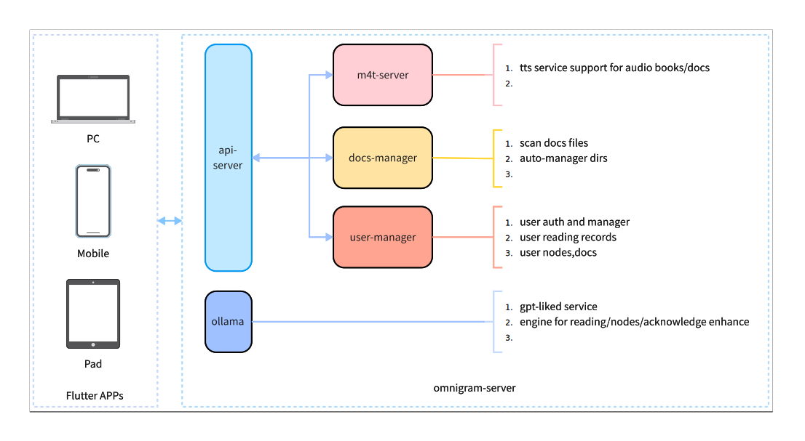

#

<picture>
  <source
    srcset="./docs/static/img/logo_with_letter_dark.svg"
    media="(prefers-color-scheme: dark)"
  />
  <source
    srcset="./docs/static/img/logo_with_letter_white.svg"
    media="(prefers-color-scheme: light), (prefers-color-scheme: no-preference)"
  />
  
</picture>

<div style="font-size: 1.5rem;">
  <a href="./README.md">English</a> | <a href="./README.zh.md">中文</a>
</div>
</br>

 
 


## About Omnigram

Omnigram is a multi-platform (iOS, Android, Web, Windows, Linux, Mac) file reading and audiobook client written in Flutter. It supports multiple formats, including EPUB and PDF. It provides audiobook functionality through TTS models and supports other AI models for assisted reading. In addition, it has local book management capabilities, allowing users to easily manage book storage on NAS. For its backend service deployment, refer to [omnigam-server](server/README.md). Or check the [official project documentation](https://omnigram.lxpio.com/).

## Features

- [x] Supports iOS and Android for EPUB ebook reading
- [x] Supports TTS text-to-speech, allows custom TTS engines
- [x] Supports local book management (NAS), including searching, reading, listening, notes, favorites, downloading, deleting books, settings, etc.
- [x] Supports conversational assistant with Markdown support, code block highlighting, conversation settings
- [x] Books support TTS reading using models
- [ ] Supports PDF, documents and other NAS content services management
- [ ] Supports Web, Windows, Linux, Mac

## Omnigram Infrastructure



## Official Documentation

You can find the official documentation (including installation manuals) at <https://omnigram.lxpio.com/>.

## Examples

For the mobile app, you can use https://omnigram-demo.lxpio.com:9443 for the Server Endpoint URL

```
The credential
email: admin
password: 123456
```


## For Dev

This project uses a three-way repository including:

- [riverpod](https://docs-v2.riverpod.dev/docs)
- [isar](https://isar.dev)

### Build

#### For Omnigram APP 

```bash

git clone github.com/lxpio/omnigram.git
cd omnigram/app
make
```

#### For Omnigram Server

```bash

git clone github.com/lxpio/omnigram.git
cd omnigram/server
make 

# make docker 
```

## License

This project is licensed under the MIT License - see the [LICENSE.md](LICENSE.md) file for details